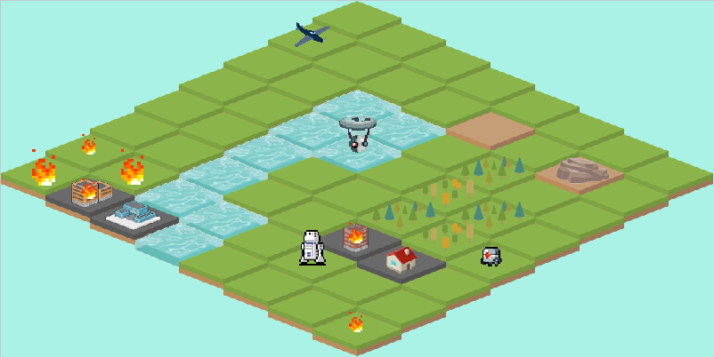

<a name="readme-top"></a>
[](https://github.com/julienbrs)
[![LinkedIn][linkedin-shield]][linkedin-url]

<!-- PROJECT LOGO -->
<br />
<div align="center">
  <a href="https://github.com/julienbrs/fire-extinguishing-simulation">
    
  </a>

<h3 align="center">Fire Extinguishing Simulation</h3>
  </p>
</div>

<!-- TABLE OF CONTENTS -->
<summary>Table of Contents</summary>
<ol>
  <li>
    <a href="#about-the-project">About The Project</a>
  </li>
  <li>
    <a href="#getting-started">Getting Started</a>
    <ul>
      <li><a href="#prerequisites">Prerequisites</a></li>
      <li><a href="#installation">Installation</a></li>
    </ul>
  </li>
  <li><a href="#contact">Contact</a></li>
</ol>

<br />

<!-- ABOUT THE PROJECT -->

## About The Project

[](https://www.java.com/fr/)

This project focuses on the development of a Java application to simulate a ́team of firefighting robots operating autonomously in a natural environment.

It has a 3d isometric graphical interface and complex strategies to calculate the shortest path while optimizing the coordination of the robots have been implemented.

**For more details and visuals, see the report available in English and French**.

#### Inside the repo

- assets: assets used for the project

- cartes: some examples of data files

- bin/gui.jar: Java archive containing the GUI classes.

- doc: the documentation (API) of the classes. Entry point: index.html

<br />



<p align="right">(<a href="#readme-top">back to top</a>)</p>

<!-- GETTING STARTED -->
<br />

## Getting Started

To get a local copy up and running follow these simple example steps.

### Installation

- Clone the repo

  ```sh
  git clone https://github.com/julienbrs/fire-extinguishing-simulation.git
  ```

- `make` builds the executables and libraries of the source files

- `make clean` : suppression des fichiers .class dans bin

### Test

- make exeCarte : run the test TestCarte
- make exeRobots : run the test TestRobot
- make exeDijkstra : run the test TestDijkstra
- make exeSimulateurOK : run the test TestSimulateurOK
- make exeChemin : run the test TestChemin
- make exeSimulateur : run the testSimulation
- make exeStrategie : run the testStrategie

- make exeOptimisationB : run the optimisation test (b)
- make exeSimulateurPropagation : run the optimisation test (c)

### To Test maps

We have provided a shell script to run the simulation with or without fire propagation **for any map**.
The usage is `./testCarte.sh <n> <PATH_TO_MAP>`

_n is 1 to run the simulation with fire propagation, and 0 if we want a normal simulation._

<br />

There are 4 test files available.

It is possible to plot the performance graphs of the algorithms thanks to a result file, by calling the trace_graphe() function in the main.py program
The file must have the format: time_divide, time_naive, nb_points

<p align="right">(<a href="#readme-top">back to top</a>)</p>

<!-- CONTACT -->

## Contact

Bourseau Julien - _Made in 2nd year at Ensimag_ - julien.bourseau@gmail.com

Project Link: [https://github.com/julienbrs/fire-extinguishing-simulation](https://github.com/julienbrs/fire-extinguishing-simulation)

<p align="right">(<a href="#readme-top">back to top</a>)</p>

[linkedin-shield]: https://img.shields.io/badge/-LinkedIn-black.svg?style=for-the-badge&logo=linkedin&colorB=555
[linkedin-url]: https://www.linkedin.com/in/julien-bourseau-ba2239228
